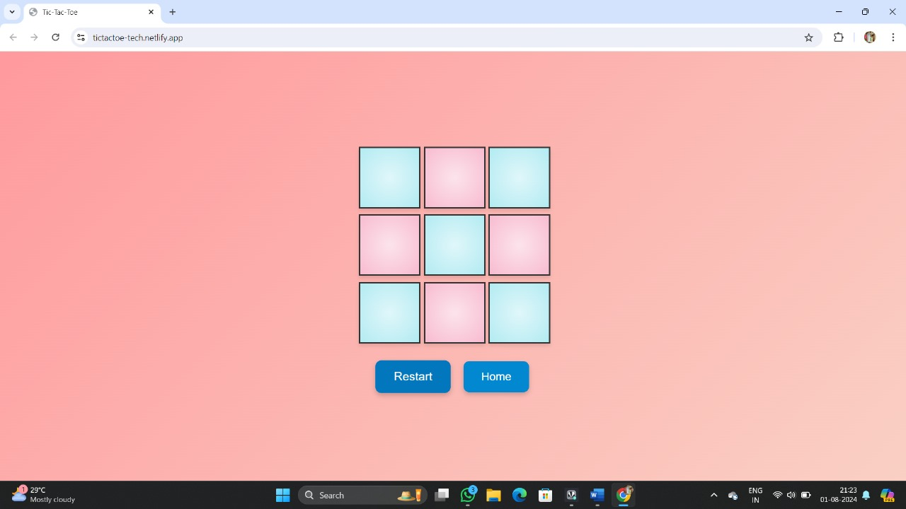

# Tic-Tac-Toe Web Application

## Project Description

🚀 This project is part of my internship at Prodigy Infotech, where I built a Tic-Tac-Toe web application using HTML, CSS, and JavaScript. By implementing functions to handle user clicks, track game state, and check for winning conditions, users can play against each other or against an AI opponent, aiming to get three markers in a row to win the game.

## Features

- **Player vs Player Mode**: Users can play against each other.
- **Player vs AI Mode**: Users can play against a computer opponent.
- **Winning Conditions**: Checks for horizontal, vertical, and diagonal wins.
- **Responsive Design**: The game works seamlessly on different screen sizes.

## Technologies Used

- **HTML**: For structuring the game.
- **CSS**: For styling the game.
- **JavaScript**: For adding functionality and interactivity to the game.

## Screenshots


*Screenshot of the Tic-Tac-Toe web application.*

## Setup Instructions

1. **Clone the repository:**
   ```bash
   git clone https://github.com/Nareshbrabha/tic-tac-toe-web-application.git
